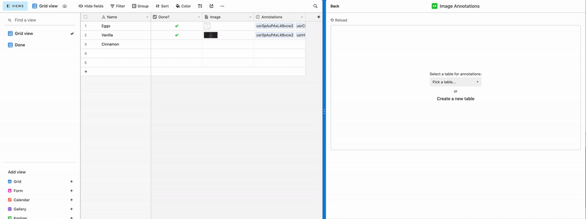

# Airtable Image Annotations Block

## About the block
Create annotations for images stored in Attachment fields and save it back to Airtable

## How to use this block

1. In your Airtable base, open the Blocks sidebar on the right, and click **Install a block**
1. In the modal that opens, click **Build a custom block**
1. Select **Remix from GitHub** on the **Build a block** modal
1. Enter `Image Annotations Block` in the **Block name** field
1. Enter `https://github.com/kmadorin/airtable_image_annotations` in the **GitHub repository** field

    

1. Click **Create block**, and follow the instructions on the next screens to run and test the Block locally

## See the block running

## Try it in action
![Demo table] (https://airtable.com/invite/l?inviteId=inv40V01ZlfMpVOtw&inviteToken=65aa3a7406bfa739441644955c7fe8f87fc27506915cfcbad2d126d50e5c4343)

## Future TODOs
- [ ] Add another shapes for markers (line, rectangle, arrow, brush)
- [ ] Add a possibility to change the color of the marker's shape
- [ ] Image annotations for creating datasets for AI (2D and 3D bounding boxes, lines and splines, tags, polygons, semantic segmentation)
- [ ] Image annotations for commenting and grading student's works